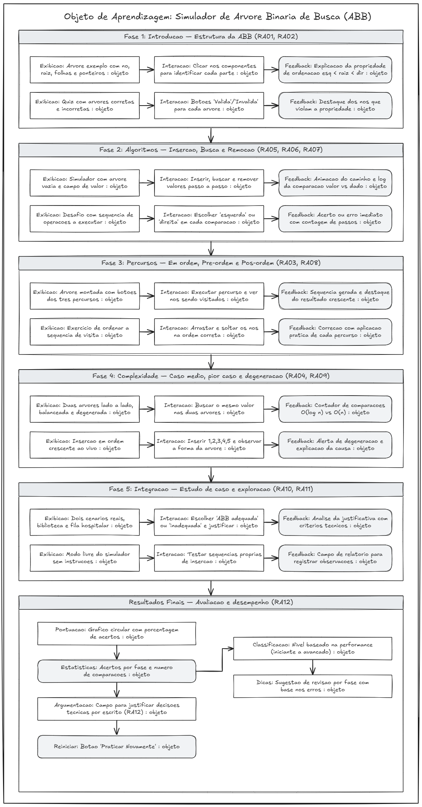

# Objeto de Aprendizagem — Árvore Binária de Busca (ABB)

**Universidade Tecnológica Federal do Paraná — UTFPR Campo Mourão**
Disciplina: OPT016 | Bacharelado em Ciências da Computação
---

## Público-Alvo

Este objeto de aprendizagem é destinado a **estudantes de graduação em Ciências da Computação ou áreas afins** que já possuam conhecimento básico de programação (variáveis, condicionais, laços) e noções introdutórias de estruturas de dados (listas, ponteiros/referências). O material é adequado para ser utilizado em disciplinas de Estruturas de Dados ou Algoritmos, tipicamente cursadas no 2.º ou 3.º período do curso.

---

## Requisitos de Aprendizagem

Os requisitos estão organizados em três dimensões — Conceitos, Habilidades e Disposições — e cobrem do nível **Lembrar** ao nível **Avaliar** da Taxonomia de Bloom Revisada. A definição completa de cada requisito, com critérios de avaliação, está disponível no documento abaixo.

**[Requisitos de Aprendizagem (PDF)](https://docs.google.com/document/d/1UkFJsJOtB3VgTnSJ0gApmXJ9kPoAxOMGay7oKA7teRU/edit?usp=sharing)**

### Resumo

| ID | Requisito | Bloom | Dimensão |
|----|-----------|-------|----------|
| RA01 | Reconhecer a estrutura da ABB | Lembrar | Conceito |
| RA02 | Compreender a propriedade de ordenação | Compreender | Conceito |
| RA03 | Compreender os tipos de percurso | Compreender | Conceito |
| RA04 | Analisar a complexidade dos algoritmos | Analisar | Conceito |
| RA05 | Executar o algoritmo de inserção | Aplicar | Habilidade |
| RA06 | Executar o algoritmo de busca | Aplicar | Habilidade |
| RA07 | Executar o algoritmo de remoção | Aplicar | Habilidade |
| RA08 | Aplicar os percursos e interpretar resultados | Aplicar | Habilidade |
| RA09 | Comparar desempenho entre estruturas diferentes | Analisar | Habilidade |
| RA10 | Avaliar a adequação da ABB para um problema | Avaliar | Disposição |
| RA11 | Demonstrar autonomia na experimentação | Avaliar | Disposição |
| RA12 | Argumentar sobre decisões técnicas com clareza | Avaliar | Disposição |

**Total: 12 requisitos** — Conceitos: 4 | Habilidades: 5 | Disposições: 3

---

## Modelo Instrucional



Arquivo fonte editável: [Abrir no Excalidraw](https://excalidraw.com/#json=DOsUCO4WP-VTX1g5I4MU1,XkVF4PvQ2pBJ8ejLY2pCog)

---

## Mapa Conceitual

O mapa conceitual do objeto de aprendizagem está disponível em:
[https://cmapscloud.ihmc.us/rid=22N2J5C0W-248XK8G-LP31GZ](https://cmapscloud.ihmc.us/rid=22N2J5C0W-248XK8G-LP31GZ)

---

## Sobre o Projeto

Este repositório contém o desenvolvimento do objeto de aprendizagem interativo sobre Árvore Binária de Busca, implementado com **React + Vite**. O OA oferece simulações visuais das operações de inserção, busca e remoção, bem como dos três tipos de percurso (em ordem, pré-ordem e pós-ordem), com o objetivo de apoiar a aprendizagem ativa dos conceitos e algoritmos da ABB.

### Execução local

```bash
npm install
npm run dev
```
